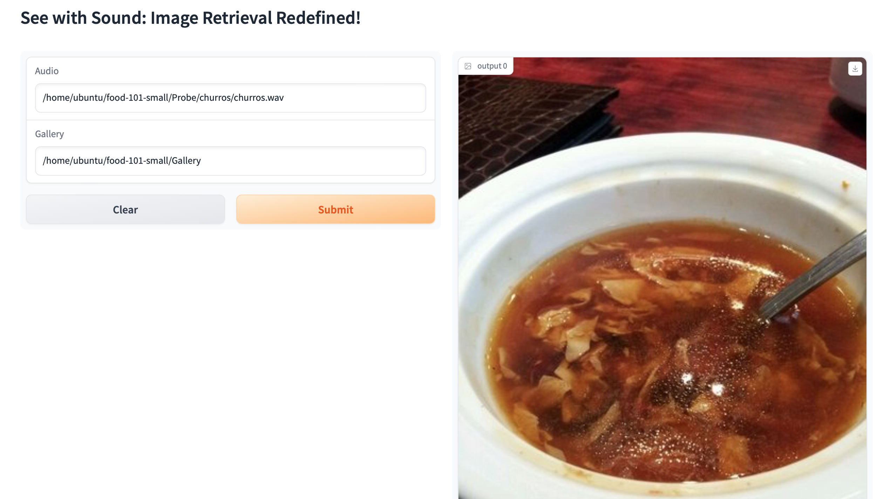
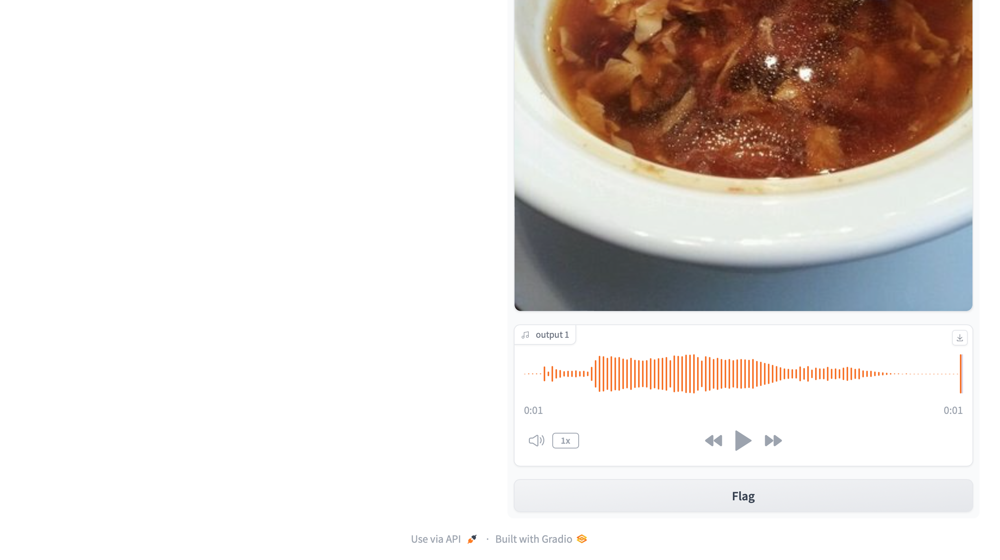

# See-with-Sound


### Code:

Below are the step to setup the code and perform training

### Setup:

After setting up the code as below, update the paths appropriately

`git clone https://github.com/ksasi/See-with-Sound.git`


### Dataset:

- Download [Food-101](https://data.vision.ee.ethz.ch/cvl/datasets_extra/food-101/) dataset
- Execute ipython notebook `Minor_Project_Data_Curation.ipynb` to generate audio samples for each category
- Execute ipython notebook `Minor_Project_DataSet_Setup.ipynb` to **setup food-101-small** dataset
- The **setup food-101-small** dataset consists of `Train`, `Probe`, `Gallery` and `Other` folders

Dataset **setup food-101-small** structure :


```
food-101-small/
              Train/
                  <class_name>/
                            <image_id1>.jpg
                            <image_id2>.jpg
                            ...
                            ...
                            ...
              Probe/
                  <class_name>/
                            <class_name>.wav
              Gallery/
                  <class_name>/
                            <image_id1>.jpg
                            <image_id2>.jpg
                            ...
                            ...
                            ...
              Other/
                  No_Image_Available.jpg
```

### Training:

After updating the paths, train `SGDClassifier` incrementally as below :

`nohup python model_train.py &`

### Evaluation:

The trained model can be evaluated as below :

`nohup python evaluate.py &`

### Results:

The CMC Curve of Probe and Gallery is shown below :


Rank1 Identification Accuracy: 87.097%

### Demo:

Demo of Image search from audio input can be executed by running `Audio_Image_Search_Demo.ipynb` ipython notebook




### References

The code is adapted from the following repositories:

- Low Resolution face recognition - [Github Link](https://github.com/ksasi/face-recognition)